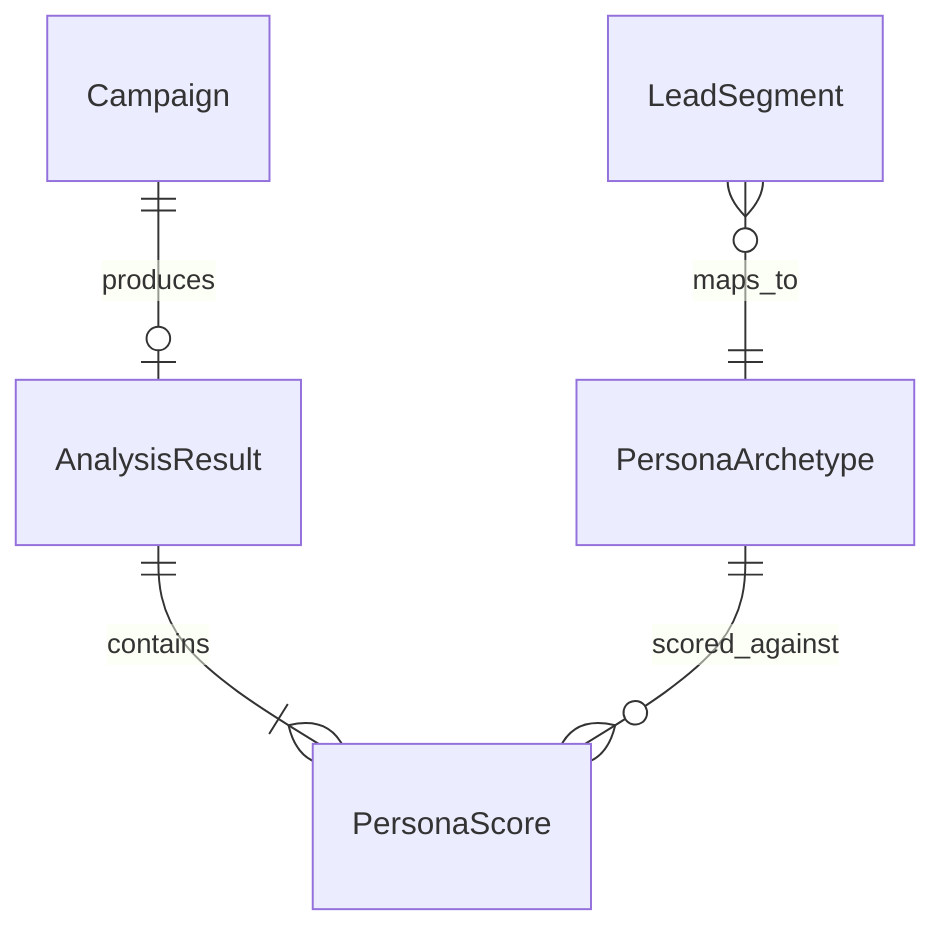
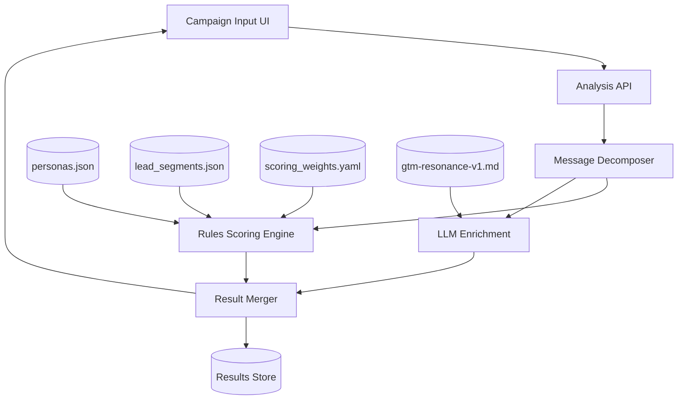

# PRD � digiZT GTM Resonance & Response Analytics

## Document Metadata

| Field | Value |
|-------|-------|
| **Product / Feature Name** | digiZT GTM Resonance & Response Analytics |
| **Owner (PM)** | TBD |
| **Tech Lead** | TBD |
| **Status** | ?? In Review |
| **Version** | v1.0 Draft |
| **Last Updated** | 2026-07-01 |
| **Canonical Location** | `docs/PRD-digiZT-GTM-Resonance.md` |

---

## 1) Executive Summary

**Context:** Marketing teams run pet health / insurance campaigns without systematic persona fit testing. Research exists in spreadsheets (`Persone(List1).csv`, persona template `prenos.jpg`, `Lead_segments.xlsx`) but is not operationalized.

**Problem:** Campaigns are built on intuition. Teams cannot predict content acceptance, appeal, CTR, or funnel conversion by persona before spend.

**Solution:** A web application where users input ad campaign details; the engine computes persona-level GTM scores and aggregate response analytics using a documented scoring model and system prompt.

**Primary Value Propositions:**

- Pre-launch campaign scoring by persona archetype
- Funnel leak identification before media spend
- Actionable copy/channel recommendations grounded in interview data
- Repeatable GTM methodology (not one-off consulting)

**Strategic Alignment:** Supports data-driven GTM for digiZT digital pet health / insurance products.

---

## 2) Scope Definition

### In Scope

- Campaign input form (headline, body, CTA, channel, offer, tone, etc.)
- Persona library (6 archetypes from CSV + template)
- Scoring engine: CAS, Appeal Index, pCTR, pCVR
- Per-persona and aggregate analytics dashboard
- JSON export + optimization playbook
- System prompt as versioned config (`prompts/gtm-resonance-v1.md`)

### Out of Scope (v1)

- Live ad platform integration (Meta/Google APIs)
- Actual performance ingestion / model training
- A/B test execution
- Multi-language beyond Slovenian

### Future Considerations / Phase 2+

- Calibrate weights from `Lead_segments.xlsx` + historical campaign data
- ML refinement from actual CTR/CVR back-testing
- Vet partnership channel integration

---

## 3) Goals, Success, and Constraints

### 3.1 One-Line Project Framing

```text
Make me a GTM campaign analytics app
for pet health / insurance marketing teams
that helps predict persona resonance and funnel performance
by scoring ad campaign input against research-backed persona archetypes.
```

### 3.2 Primary Goal

```text
[Primary Goal]: I need a scoring application that predicts GTM appeal and funnel response by persona before campaign launch.

[Context]: This is for digiZT marketing and product teams, where persona fit and vet-trust messaging matter.

[Examples & Performance]: Success means a campaign manager pastes ad copy and gets persona scores + recommendations in under 2 minutes � not a generic "looks good" opinion.

[Constraints]: Focus on auditable rules-based scoring; avoid black-box claims of actual performance.

[Outcome]: The user should know which personas will accept the message, click, and convert � and what to change before spend.
```

### 3.3 Definition of Success

| Type | Metric |
|------|--------|
| **Business** | 30% reduction in wasted ad spend on mismatched segments |
| **User** | Campaign scored in < 2 minutes with clear recommendations |
| **Technical** | Deterministic scoring + optional LLM enrichment; reproducible outputs |

### 3.4 Hard Constraints

- WCAG 2.1 AA for dashboard
- No PII storage in v1
- Scoring logic auditable (weights in config, not black box)
- Slovenian primary UI/copy
- All outputs labeled as predicted/modeled

---

## 4) Target Market & User Analysis

### 4.1 Ideal Customer Profile

- Insurance / pet product marketing teams, agencies, product owners at digiZT
- Teams running Meta, Google, email, or vet-partnership campaigns
- Need pre-launch validation against pet-owner research

### 4.2 Personas (application users)

| Persona | Role | Success |
|---------|------|---------|
| **Campaign Manager** | Runs paid campaigns | Fast pre-launch score and persona targeting |
| **Creative Strategist** | Writes ad copy | Hook/tone/barrier feedback |
| **Product Owner** | Owns digiZT GTM | Aggregate funnel forecasts and KPI alignment |

---

## 5) User Stories, Flows, and Acceptance Criteria

### 5.1 User Stories

1. As a **campaign manager**, I want to paste ad copy and select channel so that I see predicted appeal by persona before launch.
2. As a **creative strategist**, I want message decomposition (hooks, barriers, missing trust signals) so that I can revise copy iteratively.
3. As a **product owner**, I want aggregate CTR/CVR and funnel leak stage so that I can prioritize optimization.

### 5.2 Critical User Flow: Score Campaign

**Steps:**

1. User opens app ? New Campaign
2. Fills required fields (headline, primary text, CTA, channel, objective, tone, offer)
3. Clicks **Analyze**
4. Engine: decompose message ? score each PA-xx ? compute aggregates
5. Dashboard: persona heatmap, funnel chart, recommendations
6. User exports JSON or PDF summary

**Success scenario:** User receives all 6 persona scores, aggregate metrics, and prioritized optimization playbook.

**Edge cases:**

- Empty trust signals ? penalty on PA-03, PA-05
- Urgency + no proof ? global conversion penalty
- `target_segment_hint` set ? highlight selected persona, still show all

**Acceptance criteria:**

- [ ] All 6 personas scored on every run
- [ ] Results reproducible for same input + config version
- [ ] Recommendations cite specific copy elements
- [ ] Analysis completes in < 10s (LLM) or < 1s (rules-only mode)

---

## 6) Requirements

### 6.1 Feature: Campaign Input

| Field | Type | Required |
|-------|------|----------|
| campaign_name | string | yes |
| objective | enum | yes |
| channel | enum | yes |
| format | enum | yes |
| headline | string | yes |
| primary_text | textarea | yes |
| cta | string | yes |
| offer | string | yes |
| tone | enum | yes |
| price_signal | enum | yes |
| trust_signals | multi-select | no |
| target_segment_hint | enum | no |
| visual_description | textarea | no |

### 6.2 Feature: Scoring Engine

**Overview:** Core computation layer applying CAS ? Appeal ? pCTR ? pCVR pipeline.

**Priority:** Critical

**Functional requirements:**

1. Load persona definitions from `data/personas.json`
2. Load segment weights from `data/lead_segments.json` (when available) or defaults
3. Apply weights from `config/scoring_weights.yaml`
4. Optional LLM pass for message decomposition + rationale (`prompts/gtm-resonance-v1.md`)
5. Merge rules-based scores with LLM insights

**Acceptance criteria:**

- [ ] Scores are 0�100 for CAS and Appeal Index
- [ ] pCTR and pCVR returned as percentages with 2 decimal places
- [ ] Funnel stages returned per persona
- [ ] Assumptions array populated when Lead_segments not loaded

### 6.3 Feature: Analytics Dashboard

- Persona comparison table (CAS, Appeal, pCTR, pCVR)
- Funnel waterfall per persona
- Aggregate weighted metrics
- Optimization playbook (prioritized list)
- Message decomposition panel (hooks vs barriers)

### 6.4 Non-Functional Requirements

| Area | Target |
|------|--------|
| Performance | P95 analysis < 10s |
| Accessibility | WCAG 2.1 AA |
| Security | API keys server-side only |
| Maintainability | Weights in YAML/JSON config |
| Reliability | Reproducible rules engine output |

### 6.5 Dependencies & Integrations

| Dependency | Purpose |
|------------|---------|
| `Persone(List1).csv` | Persona research source |
| `prenos.jpg` | Persona template dimensions |
| `Lead_segments.xlsx` | Segment weights + benchmarks (Phase 2) |
| LLM provider (optional) | Message decomposition |

---

## 7) Data, Domain, and Terminology

### 7.1 Glossary

| Term | Definition |
|------|------------|
| **CAS** | Content Acceptance Score � will audience receive this message? |
| **Appeal Index** | Message fit to persona goals/motivations/concerns |
| **pCTR** | Predicted click-through rate (modeled) |
| **pCVR** | Predicted conversion rate (modeled) |
| **Persona Archetype** | Research-backed segment (PA-01 � PA-06) |
| **Lead Segment** | Population-weighted targeting group from Lead_segments |

### 7.2 Domain Model

#### PersonaArchetype

- `id`, `name`, `template_column`, `age_range`, `income_range`
- `goals[]`, `motivations[]`, `concerns[]`, `channels[]`
- `decision_model`, `messaging_hooks[]`, `barriers[]`
- `funnel_multipliers`

#### Campaign

- Input fields + `created_at`, `config_version`

#### AnalysisResult

- `persona_scores[]`, `aggregate`, `message_decomposition`, `optimization_playbook`



---

## 8) Architecture, Tech Stack, and Interfaces

### 8.1 System Architecture



### 8.2 Technology Stack (recommended)

| Layer | Choice | Rationale |
|-------|--------|-----------|
| Frontend | Next.js + TypeScript + Tailwind | Fast UI, type safety |
| Backend | API routes or FastAPI | Scoring + optional LLM |
| Scoring | TypeScript rules engine | Auditable, reproducible |
| Config | JSON/YAML | Version-controlled weights |

### 8.3 API Design (v1)

**POST /api/analyze**

Request: Campaign input schema (see 6.1)

Response: AnalysisResult JSON (see system prompt output schema)

---

## 9) Codebase Structure

```text
reverse_GTM-digiZT/
??? prompts/
?   ??? gtm-resonance-v1.md
??? data/
?   ??? personas.json
?   ??? lead_segments.json          # Phase 2
??? config/
?   ??? scoring_weights.yaml
??? docs/
?   ??? PRD-digiZT-GTM-Resonance.md
??? Persone(List1).csv
??? src/                            # Application (Phase 2)
    ??? lib/scoring/
    ??? app/
```

---

## 10) Quality Assurance & Testing Strategy

| Type | Scope |
|------|-------|
| Unit tests | Scoring functions, weight application, aggregate math |
| Integration tests | Full analyze pipeline with fixture campaigns |
| UAT | Campaign manager validates recommendations against known campaigns |
| Regression | Same input + config ? same numeric output |

---

## 11) Delivery Plan

| Phase | Deliverable | Effort | Dependencies |
|-------|-------------|--------|--------------|
| **1 � Foundation** | personas.json, scoring_weights.yaml, system prompt | S | CSV + template |
| **1 � Foundation** | Rules scoring engine (no LLM) | M | Config files |
| **2 � Core** | Campaign input UI + results table | M | Scoring engine |
| **2 � Core** | LLM message decomposition | S | System prompt |
| **3 � Analytics** | Funnel viz + JSON export | M | UI |
| **3 � Analytics** | Import Lead_segments.xlsx | S | xlsx file |
| **4 � Calibration** | Benchmark tuning from historical data | L | Campaign results |

### Milestones

| Phase | Exit criteria |
|-------|---------------|
| Phase 1 | Sample campaign scores reproducibly via CLI/API |
| Phase 2 | End-to-end UI analyze flow works |
| Phase 3 | Export + dashboard complete |
| Phase 4 | Weights calibrated vs actuals |

---

## 12) Metrics & KPIs

| KPI | Baseline | Target | Data source |
|-----|----------|--------|-------------|
| Time to score campaign | N/A | < 2 min | App telemetry |
| Recommendation action rate | N/A | > 50% | User feedback |
| Pre-launch persona mismatch rate | Unknown | -30% wasted spend | Campaign vs score |
| Scoring reproducibility | N/A | 100% same input | Unit tests |

---

## 13) Risks, Assumptions, and Open Questions

### 13.1 Risks

| Risk | Impact | Likelihood | Mitigation |
|------|--------|------------|------------|
| Lead_segments.xlsx missing | Medium | High | Default weights; block "calibrated mode" |
| Predicted vs actual gap | High | Medium | Label outputs; Phase 4 back-testing |
| LLM non-determinism | Medium | Medium | Rules engine as source of truth for numbers |

### 13.2 Assumptions

- Product context is pet health / pet insurance (digiZT)
- Conversion = quote request or policy completion
- Interview data (51 owners) is representative enough for v1 archetypes
- Veterinar is primary trust anchor across segments

### 13.3 Open Questions

- [ ] Confirm product = pet insurance vs broader pet health?
- [ ] Provide `Lead_segments.xlsx` for benchmark calibration
- [ ] Preferred channels for digiZT (Meta, Google, vet partners)?
- [ ] Conversion definition: quote request, policy purchase, or vet booking?

---

## 14) Review and Change Log

| Date | Version | Changes | Author |
|------|---------|---------|--------|
| 2026-07-01 | v1.0 Draft | Initial PRD from GTM reverse-engineering | AI-assisted |

---

## Appendix A) Scoring Reference

### Persona archetypes (summary)

| ID | Name | Template | Primary hook | Primary barrier |
|----|------|----------|--------------|-----------------|
| PA-01 | Urban Companion | Mo�ki/�enska (mladi) | Dru�ba, terapevtski u?inek | Cena, kompleksnost |
| PA-02 | Active Family | Dru�ina z otroci | Dru�inski ?lan, nepredvideni stro�ki | Ve? odlo?evalcev |
| PA-03 | Retiree Guardian | Upokojenci | Zanesljivost, veterinar | Digitalna kompleksnost |
| PA-04 | Premium Researcher | Zaposleni (visok dohodek) | Kvaliteta, premium kritje | Brez dokazov/primerjave |
| PA-05 | Practical Provider | Zaposleni (srednji) | Konkretni scenariji ob bolezni | Odla�anje |
| PA-06 | Student / Dependent | �tudenti | Dru�abnost (awareness) | Ni pla?nik |

### Funnel stages

1. **Impression ? Click** (pCTR)
2. **Click ? Engagement** (landing bounce inverse)
3. **Engagement ? Intent** (form start, CTA click)
4. **Intent ? Conversion** (quote / purchase complete)

### Research insights (from Persone(List1).csv)

- ~90% of owners respond "veterinar" when pet is injured/sick
- Insurance awareness very low in interview sample
- Health priorities: hrana, gibanje, nega, kvaliteta
- Price vs quality: lower income ? cena; higher income ? kvaliteta
